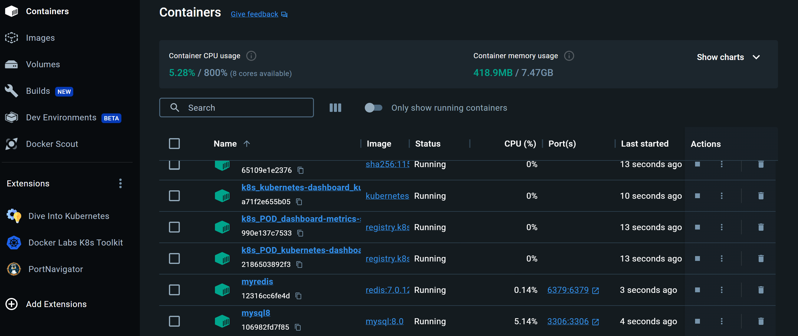
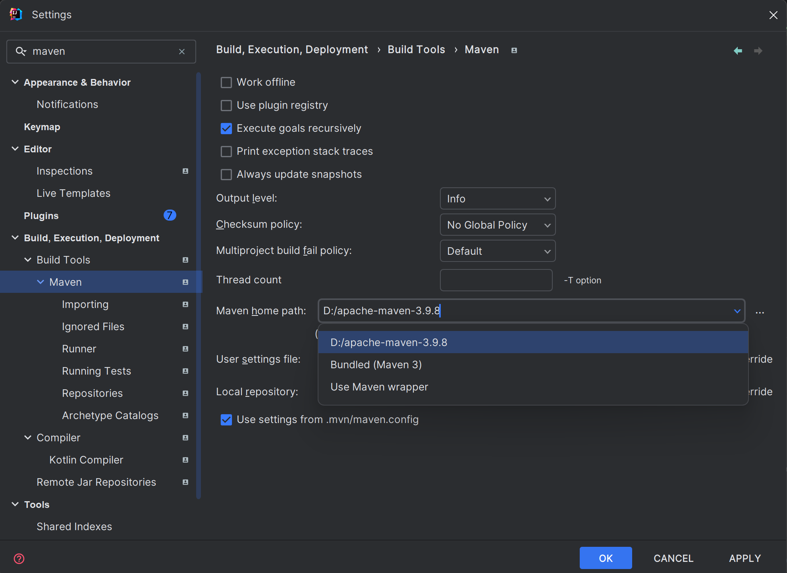
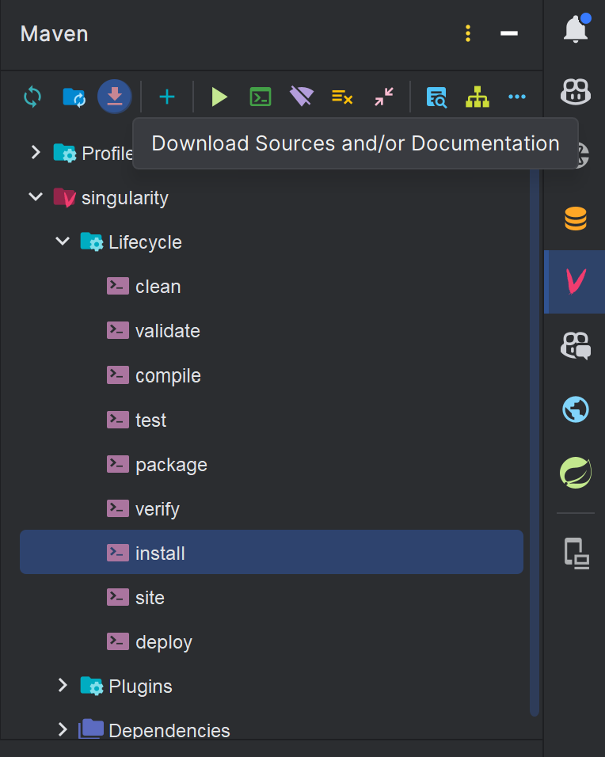

# SPM_backend
上海理工大学项目管理与过程改进的后端代码

接口文档地址：http://localhost:8080/doc.html

## 前置条件

首先需要确保你的电脑上安装有`docker`，如果没有，那么请到官网上安装[Docker Desktop: The #1 Containerization Tool for Developers | Docker](https://www.docker.com/products/docker-desktop/)

`docker`安装完成后，打开`windows`的`cmd`，输入以下命令，开启`redis`

```bash
docker run -p 6379:6379 --name myredis -d redis
```

输入以下命令开启`mysql`

```bash
docker run -p 3306:3306 -d --name mysql8 -e MYSQL_ROOT_PASSWORD=123456 mysql:8
```

输入以下命令开启`minio`

```bash
docker run -d --name minio -p 9000:9000 -p 9090:9090 -v /mnt/data:/data minio/minio server /data
```

进入`docker desktop`，确保`mysql`和`redis`服务正常运行



然后找到`src/main/resources/application.example.yaml`文件：

里面`minio`文件存储服务的token的配置可以自行网上搜索

```yaml
spring:
  application:
    name: spm_backend
  datasource:
    # mysql
    driver-class-name: com.mysql.cj.jdbc.Driver
    username: root
    password: 123456
    url: jdbc:mysql://localhost:3306/spm?serverTimezone=UTC&useUnicode=true&characterEncoding=utf-8&allowPublicKeyRetrieval=true
  data:
    redis:
      host: localhost
      port: 6379
      database: 3
  main:
    allow-bean-definition-overriding: true
minio:
  endpoint: http://localhost:9000           # 替换为您的 MinIO 服务地址
  access-key: 2IapYfTR6v67wch7DsBK               # 替换为您的 MinIO Access Key
  secret-key: 1EMUw3wEsDfPSoXQGWXEjupsKwb89ByIdfCdkVMn               # 替换为您的 MinIO Secret Key
  bucket-name: spm              # 替换为您想使用的 Bucket 名称
security:
  paths:
    publicRoutes:
      - /doc.html
      - /webjars/**
      - /v3/api-docs/**
      - /auth/**
    authenticated:
      - /user/**  # 需要登录的路径
      - /course/**
      - /paper/**
      - /question/**
# 在生产环境中，需要禁用swagger
springdoc:
  api-docs:
    enabled: true
knife4j:
  setting:
    language: zh_cn
mybatis-plus:
  configuration:
    log-impl: org.apache.ibatis.logging.stdout.StdOutImpl
server:
  forward-headers-strategy: framework
```

确保`mysql`的配置信息，`redis`的配置信息，文件上传和下载的路径配置没有任何问题。然后把他重命名为`application.yaml`文件

然后找到`src/main/resources/db/spm.sql`文件，打开`mysql`创建`spm`数据库

```sql
create database spm
```

然后使用数据库

```sql
use spm
```

最后执行`.sql`文件里面的所有代码。

## 开发环境配置

首先安装`idea`专业版，可以到`jetbrain`的官网申请教育版，免费使用`idea`软件。

然后找到`file/settings`选项卡，输入`maven`，找到`maven`控制



可以使用`idea`自带的`maven`配置，也可以自己单独额外装一个`maven`，完成`maven`的配置

然后找到`idea`的右边框，`maven`选项，点击如图所示的下载按钮



等待相关依赖安装完毕，然后就可以运行了。

然后找到`src\main\java\cn\usst\spm\SPMBackendApplication.java`文件，运行它即可完成项目的启动。

若要设置为管理员权限，只需要打开`mysql`，在`user_roles`表当中添加用户的`user_id`字段和`role_name`字段即可，`role_name`字段仅限`teacher`和`admin`两种，分别表示教师和管理员。若不添加`role`字段，默认表示为学生权限。
